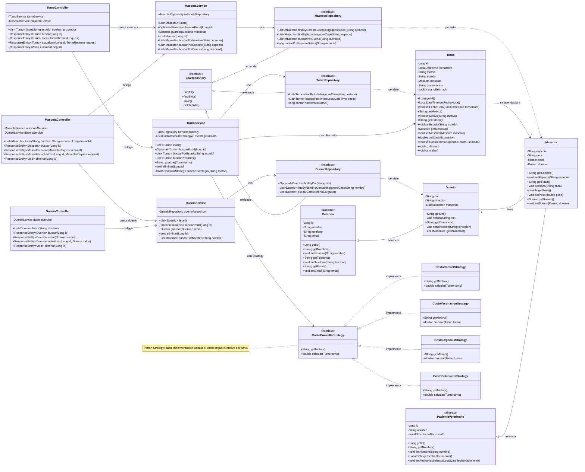

# Diagrama de clases - Veterinaria App

Este diagrama muestra las clases principales del sistema, sus relaciones y los
conceptos de POO aplicados: herencia, clases abstractas, interfaces,
polimorfismo y patron Strategy.

> Este archivo representa un diagrama de clases.

## Lectura rapida

- `Persona` y `PacienteVeterinario` son clases abstractas: representan conceptos generales.
- `Duenio` y `Mascota` son entidades concretas que heredan atributos comunes.
- `Duenio` tiene muchas `Mascota`; cada `Mascota` pertenece a un `Duenio`.
- `Turno` se agenda para una `Mascota`.
- Los controllers reciben solicitudes HTTP y delegan en services.
- Los services contienen la logica de negocio y usan repositories.
- Los repositories extienden `JpaRepository` para persistir datos con JPA/Hibernate.
- `CostoConsultaStrategy` aplica Strategy: el service usa una interfaz y Spring inyecta las implementaciones concretas.
